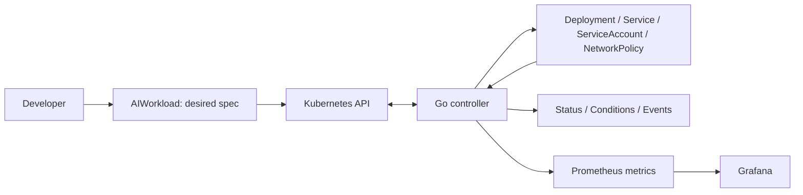

# AI Workload Control Plane

A Go-based Kubernetes operator for the declarative lifecycle of containerized AI applications.

**Stage: API contract (AWCP-4). The typed API and validation work; workload behavior is not implemented yet.**

An `AIWorkload` will describe a long-running, stateless HTTP application. The controller will reconcile its Deployment, optional ClusterIP Service, dedicated ServiceAccount and optional NetworkPolicy, then report observed status. The application inside the image supplies the AI behavior; the operator does not run models or agents itself.



## Start here

1. [Scope and supported use cases](docs/scope.md)
2. [Architecture, ownership and reconciliation](docs/architecture.md)
3. [API and status contract](docs/api-contract.md)
4. [Exact version matrix and verification limits](docs/compatibility.md)
5. [Architecture decision records](docs/adr/README.md)
6. [Acceptance and backlog traceability](docs/traceability.md)

The machine-readable selection is [toolchain.lock.json](toolchain.lock.json); exact runtime/test dependencies are resolved in `go.mod` and `go.sum`. See [local setup and commands](docs/development.md) before running anything.

```bash
make bootstrap
make verify
make test-race
make docker-build
make smoke
```

Bootstrap installs checksum-verified tools into this checkout. The smoke test uses
only its own temporary kind cluster and kubeconfig, then removes them. Initial
tool/image downloads need network access. Full prerequisites and test boundaries
are in the development guide.

## V0 boundaries

Included: one namespaced `AIWorkload` API, idempotent reconciliation, drift recovery, Secret references, workload identity, ingress policy generation, health probes, conditions/events, Prometheus/Grafana, an OpenTelemetry Collector example, unit/envtest/kind tests, Kustomize installation, CI and a reproducible local demo.

Excluded: frontend, REST management API, SaaS/accounts/billing, GPU scheduling, inference serving, LLM gateway/model routing, agent execution, vector database, PostgreSQL/Redis/message brokers, multi-cluster, cloud identity, Terraform, Argo CD, HPA, admission webhooks and full tenant isolation. Helm and traces are not V0 requirements. See the [scope decisions](docs/scope.md).

This is an alpha portfolio project, not a production-ready platform. An `AIWorkload` creator can execute an image and reference Secrets in the allowed namespace. Dedicated identity and NetworkPolicy do not make that namespace a complete tenant security boundary.

## Development status

AWCP-2 defines the intended resource contract; AWCP-3 adds the Kubebuilder project,
read-only controller, namespace-scoped manager, local tooling, tests and container.
AWCP-4 defines typed spec/status, API-server defaults and schema/CEL validation.
No child resources or workload
status are produced. Metrics, application lifecycle E2E, hosted CI and releases
remain future work. See [AWCP-2 design evidence](docs/verification/AWCP-2.md) and
[AWCP-3 execution evidence](docs/verification/AWCP-3.md) and
[AWCP-4 contract evidence](docs/verification/AWCP-4.md).

The next milestone is AWCP-5 — reconciliation foundation and ownership.
Each completed development step is validated, committed and pushed before moving on.

The [original Jira backlog export](docs/backlog/awcp-v0.md) is a dated planning snapshot. Current architecture documents and the version lock supersede its provisional choices; corrections are listed in the compatibility document.
