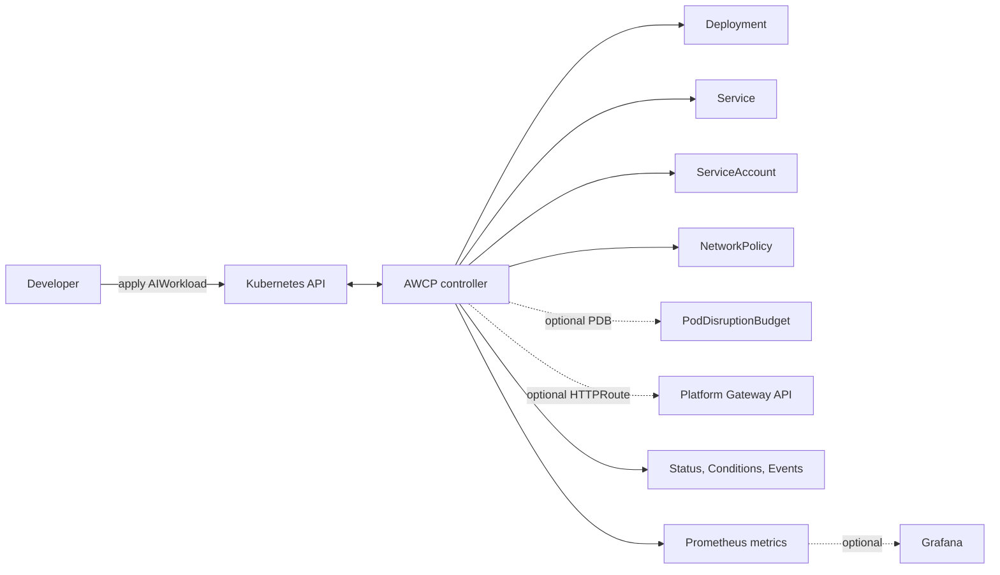
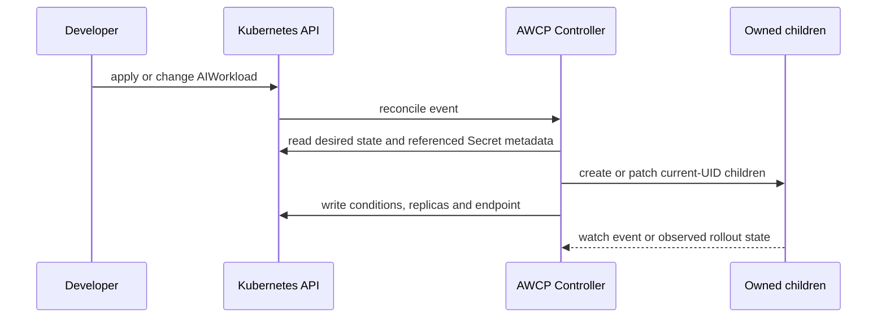

# AI Workload Control Plane

A Go-based Kubernetes operator that turns one namespaced `AIWorkload` desired-state
resource into a managed HTTP workload lifecycle.

**Stage: V1 compatibility baseline (AWCP-19).** V0 local-demo and hosted-CI
evidence remains valid; V1 begins with an additive API contract and has not
published a Git tag, GitHub Release or production image.

## Problem

Running an AI-adjacent HTTP application on Kubernetes commonly means manually
keeping a Deployment, Service, workload identity and NetworkPolicy aligned. Those
objects drift independently, and failures such as a missing Secret are difficult to
surface consistently.

## Why this exists

`AIWorkload` gives a developer one namespaced desired-state object. The controller
observes it and manages only its derived children: Deployment, optional ClusterIP
Service, dedicated tokenless ServiceAccount and optional ingress-only
NetworkPolicy. An explicit V1 opt-in can add one Gateway API HTTPRoute to that
same Service; AWCP never creates Gateway infrastructure, DNS or TLS material. The
workload image supplies application or AI behavior; AWCP never runs a model,
agent, prompt or external AI credential itself.

## Architecture



## Key concepts

- **Spec is desired state; status is observed state.** Kubernetes remains the only
  source of truth; there is no AWCP database or broker.
- **Ownership is narrow.** AWCP owns only the current CR's child tree. It never
  adopts a foreign resource and never owns, logs or deletes user Secrets.
- **Ready is a Kubernetes lifecycle signal.** It does not validate a model,
  external provider, credential value or public endpoint.

## Quick Start

This is a source checkout demo for a deliberately new local kind cluster. It needs
Docker, network access for pinned tool/image downloads, and a shell with `git` and
`make`. No cloud account, registry credential or AI credential is used.

```bash
git clone https://github.com/erayyilmmaz/ai-workload-control-plane.git
cd ai-workload-control-plane
make bootstrap
make quickstart
```

`make quickstart` creates `awcp-quickstart`, builds local non-production manager
and demo images, loads them into kind, deploys AWCP, applies
[`examples/basic.yaml`](examples/basic.yaml), and waits for `Ready=True`.

```bash
.tools/bin/kubectl -n awcp-workloads get aiworkloads,deployments,services
.tools/bin/kubectl -n awcp-workloads get aiworkload/basic-demo -o yaml
```

Remove only that explicitly named demo cluster when finished:

```bash
make kind-down
```

For a narrated, disposable full lifecycle run (including drift, Secret recovery,
authenticated metrics and garbage collection), run:

```bash
make portfolio-demo
```

It creates a random `awcp-e2e-*` cluster and removes it automatically. See the
[16-step demo guide](docs/demo.md) before presenting it.

## AIWorkload API

`AIWorkload` is `platform.example.io/v1alpha1`, namespaced, and intentionally
alpha. A minimal runnable local example is [`examples/basic.yaml`](examples/basic.yaml).

| Concern | V0 behavior |
| --- | --- |
| Image and replicas | Required image; replicas default to 1 and allow 0..20 |
| Autoscaling | Optional bounded `autoscaling/v2` HPA; enabled HPA owns live replica changes |
| Availability | Optional `policy/v1` PDB for voluntary-disruption protection; controller uses Lease-elected active/standby replicas |
| HTTP | Required container port; optional `/ready` and `/health` probes |
| Service | Optional TCP ClusterIP Service; enabled by default |
| Exposure | Optional same-namespace Gateway API HTTPRoute to the owned Service; no Gateway, DNS or TLS ownership |
| Secrets | Ordered same-namespace `envFrom` references; payload is never read by AWCP |
| Network | Optional same-namespace ingress-only NetworkPolicy; no egress isolation |
| Status | Generation, replica observations, endpoint and Ready/Progressing/Degraded conditions |

The detailed field contract and validation boundaries are in
[API contract](docs/api-contract.md). Read [autoscaling](docs/autoscaling.md), [availability](docs/availability.md) and [HTTPRoute exposure](docs/exposure.md)
before enabling external routing; it requires an administrator-provided Gateway
and disables AWCP's default same-namespace NetworkPolicy.

## Example

To demonstrate a Secret prerequisite without committing a credential:

```bash
.tools/bin/kubectl -n awcp-workloads create secret generic demo-settings \
  --from-literal=marker=synthetic
.tools/bin/kubectl apply -f examples/with-secrets.yaml
```

[`examples/network-policy.yaml`](examples/network-policy.yaml) requests the
standard ingress-only policy. Its existence is tested; traffic enforcement needs a
CNI that enforces NetworkPolicy.

## Reconciliation model



The controller uses guarded ownership and idempotent reconciliation. A same-name
resource owned by another UID becomes `ResourceOwnershipConflict`, not an adopted
or deleted object. See [architecture](docs/architecture.md) and
[reconciliation](docs/reconciliation.md).

## Drift recovery

Deleting an owned Deployment or changing an owned child field causes a new
reconciliation and restores the intended child. The portfolio demo visibly deletes
the Deployment and waits for a new UID. It also confirms that a missing required
Secret makes conditions Degraded and that restoring the Secret recovers without
editing the parent CR. It does not claim that an already running process has its
environment variables revoked or rotated.

## Security model

Each workload gets a dedicated ServiceAccount with token automount disabled and no
RoleBinding. Pods run non-root with privilege escalation disabled, all capabilities
dropped and `RuntimeDefault` seccomp. Secret references stay in the workload
namespace and only their metadata is observed. Read the full
[identity and Secret boundary](docs/identity-security.md) and
[NetworkPolicy boundary](docs/network-policy.md).

## Observability

AWCP emits bounded structured logs, Kubernetes Events and authenticated Prometheus
metrics. The base install does not deploy Prometheus, Grafana or an OpenTelemetry
Collector. A Grafana dashboard and scrape/Collector examples are optional assets;
the demo proves the underlying authenticated metrics endpoint. See
[telemetry](docs/telemetry.md).

## Testing strategy

```bash
make verify        # generated drift, build, vet, lint, format, unit/envtest, docs and safe Terraform guard
make infra-verify  # pinned Terraform/provider validation and high/critical IaC scan; never plans/applies
make verify-ci     # workflow-security structure guard
make vuln          # reachable Go vulnerability analysis
make e2e           # disposable real-kind lifecycle acceptance
make release-bundle && make verify-package
```

Hosted GitHub Actions runs the stable quality gates, including Linux AMD64 kind E2E.
Passing CI is not the same as an active merge-blocking ruleset; the repository
currently has no active ruleset. Evidence and boundaries are recorded in
[testing](docs/testing.md), [CI](docs/ci.md) and
[AWCP-16 evidence](docs/verification/AWCP-16.md).

## Architecture decisions

The accepted tradeoffs are in [the ADR index](docs/adr/README.md), including
Kubernetes as source of truth, Go/controller-runtime, namespaced scope, ownership,
least privilege, GitOps delivery and Terraform/IaC separation.

## Limitations

- Alpha portfolio project, not a production-ready platform or tenant boundary.
- No GPU scheduling, inference serving, LLM gateway/model routing, agent runtime,
  database, broker, cloud identity, webhook or multi-cluster runtime layer.
- GitOps and AWS/EKS Terraform are reference/validation assets only: no private
  repository, remote Terraform state, cloud apply, node pool, production Argo
  bootstrap, signing or production-cluster evidence exists.
- NetworkPolicy generation is proven; CNI traffic enforcement is not part of the
  default kind profile. There is no egress policy.
- HTTPRoute is an opt-in reference integration. Gateway ownership, external DNS,
  TLS, load-balancer provisioning and Gateway-to-workload network policy remain
  platform responsibilities.
- HPA object lifecycle is included, but the local baseline does not install a
  metrics adapter and rejects scale-to-zero until a Kubernetes 1.37 rebaseline.
- No automatic Secret rotation/revocation for an already running process.
- No published manager image, tag, GitHub Release, SBOM, signing or provenance yet.

## Roadmap

V0 implementation is complete pending human release authorization. AWCP-19 starts
the separate V1 compatibility baseline: existing `v1alpha1` manifests remain the
runtime contract while optional additive features are designed and delivered by
their owning stories. See the [V1 API evolution contract](docs/v1-api-evolution.md).

A V0 release still needs a human decision: activate merge rules if desired, select
a tested immutable manager image, run the release checklist, then create a
tag/release only with the resulting digest and evidence. Future platform hardening
(CNI enforcement, GitOps, cloud deployment, multi-tenancy) remains outside V0.

## Further reading

- [Installation, upgrade and safe removal](docs/installation.md)
- [GitOps and Argo CD ownership model](docs/gitops.md)
- [AWS/EKS Terraform reference](infra/terraform/README.md)
- [Release preparation checklist](docs/release.md)
- [Scope and non-goals](docs/scope.md)
- [Acceptance traceability](docs/traceability.md)
- [All execution evidence](docs/verification/)
