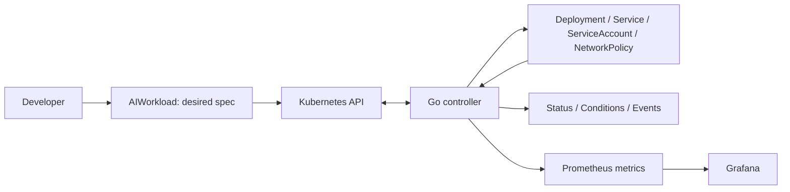

# AI Workload Control Plane

A Go-based Kubernetes operator for the declarative lifecycle of containerized AI applications.

**Stage: architecture baseline (AWCP-2). The operator is not implemented or installable yet.**

An `AIWorkload` will describe a long-running, stateless HTTP application. The controller will reconcile its Deployment, optional ClusterIP Service, dedicated ServiceAccount and optional NetworkPolicy, then report observed status. The application inside the image supplies the AI behavior; the operator does not run models or agents itself.

## Start here

1. [Scope and supported use cases](docs/scope.md)
2. [Architecture, ownership and reconciliation](docs/architecture.md)
3. [API and status contract](docs/api-contract.md)
4. [Exact version matrix and verification limits](docs/compatibility.md)
5. [Architecture decision records](docs/adr/README.md)
6. [Acceptance and backlog traceability](docs/traceability.md)

The machine-readable selection is [toolchain.lock.json](toolchain.lock.json). This pins the design baseline; `go.mod` and `go.sum` will be generated and resolved in AWCP-3.

## V0 boundaries

Included: one namespaced `AIWorkload` API, idempotent reconciliation, drift recovery, Secret references, workload identity, ingress policy generation, health probes, conditions/events, Prometheus/Grafana, an OpenTelemetry Collector example, unit/envtest/kind tests, Kustomize installation, CI and a reproducible local demo.

Excluded: frontend, REST management API, SaaS/accounts/billing, GPU scheduling, inference serving, LLM gateway/model routing, agent execution, vector database, PostgreSQL/Redis/message brokers, multi-cluster, cloud identity, Terraform, Argo CD, HPA, admission webhooks and full tenant isolation. Helm and traces are not V0 requirements. See the [scope decisions](docs/scope.md).

This is an alpha portfolio project, not a production-ready platform. An `AIWorkload` creator can execute an image and reference Secrets in the allowed namespace. Dedicated identity and NetworkPolicy do not make that namespace a complete tenant security boundary.

## Development status

The first milestone defines the resource contract and records upstream version/asset evidence. No controller build, container execution, envtest, kind E2E, hosted CI or release is claimed at this stage. See [AWCP-2 evidence](docs/verification/AWCP-2.md).

The next milestone is [AWCP-3 — repository and Kubebuilder bootstrap](https://erayyilmmaz.atlassian.net/browse/AWCP-3). Installation commands will be added when they can actually run. Each completed development step is validated, committed and pushed before moving on.

The [original Jira backlog export](docs/backlog/awcp-v0.md) is a dated planning snapshot. Current architecture documents and the version lock supersede its provisional choices; corrections are listed in the compatibility document.
