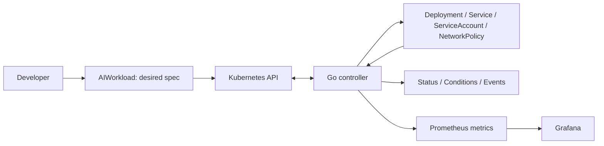

# AI Workload Control Plane

A Go-based Kubernetes operator for the declarative lifecycle of containerized AI applications.

**Stage: CI quality gates and supply-chain hygiene (AWCP-16). Secrets-free GitHub Actions gates passed once on hosted Linux AMD64; active branch ruleset/merge blocking remains separate evidence.**

An `AIWorkload` will describe a long-running, stateless HTTP application. The controller will reconcile its Deployment, optional ClusterIP Service, dedicated ServiceAccount and optional NetworkPolicy, then report observed status. The application inside the image supplies the AI behavior; the operator does not run models or agents itself.



## Start here

1. [Scope and supported use cases](docs/scope.md)
2. [Architecture, ownership and reconciliation](docs/architecture.md)
3. [API and status contract](docs/api-contract.md)
4. [Exact version matrix and verification limits](docs/compatibility.md)
5. [Architecture decision records](docs/adr/README.md)
6. [Acceptance and backlog traceability](docs/traceability.md)
7. [Test strategy and evidence boundaries](docs/testing.md)

The machine-readable selection is [toolchain.lock.json](toolchain.lock.json); exact runtime/test dependencies are resolved in `go.mod` and `go.sum`. See [local setup and commands](docs/development.md) before running anything.

```bash
make bootstrap
make verify
make test-race
make docker-build
make smoke
make e2e
make release-bundle
make verify-package
make verify-ci
make vuln
```

Bootstrap installs checksum-verified tools into this checkout. Both kind targets
use only their own temporary cluster and kubeconfig, then remove them. `make e2e`
also builds local demo v1/v2 images and proves real workload traffic, updates and
recovery. Initial tool/image downloads need network access. Full prerequisites and
test boundaries are in the development guide.

For an accessible immutable controller image, use the [installation guide](docs/installation.md). This repository does not yet publish a production image; local image tags are not a release quick start.

## V0 boundaries

Included: one namespaced `AIWorkload` API, idempotent reconciliation, drift recovery, Secret references, workload identity, ingress policy generation, health probes, conditions/events, Prometheus/Grafana, an OpenTelemetry Collector example, unit/envtest/kind tests, Kustomize installation, CI and a reproducible local demo.

Excluded: frontend, REST management API, SaaS/accounts/billing, GPU scheduling, inference serving, LLM gateway/model routing, agent execution, vector database, PostgreSQL/Redis/message brokers, multi-cluster, cloud identity, Terraform, Argo CD, HPA, admission webhooks and full tenant isolation. Helm and traces are not V0 requirements. See the [scope decisions](docs/scope.md).

This is an alpha portfolio project, not a production-ready platform. An `AIWorkload` creator can execute an image and reference Secrets in the allowed namespace. Dedicated identity and NetworkPolicy do not make that namespace a complete tenant security boundary.

## Development status

AWCP-2 defines the intended resource contract; AWCP-3 adds the Kubebuilder project,
namespace-scoped manager, initial controller, local tooling, tests and container.
AWCP-4 defines typed spec/status, API-server defaults and schema/CEL validation.
AWCP-5 adds deterministic plans, guarded create/patch/delete/no-op, child watches,
Secret metadata indexing, failure conditions/events and retry semantics. AWCP-6
activates the production Deployment mapping: image, replicas, resource quantities,
HTTP probes, ordered Secret `envFrom`, dedicated ServiceAccount binding,
security defaults and rollout strategy. AWCP-7 adds a single TCP ClusterIP
Service, deterministic in-cluster discovery endpoint, guarded enable/disable
deletion and allocated-address preservation. Dedicated ServiceAccount creation,
NetworkPolicy, complete dependency checks and workload readiness remain subsequent
work. AWCP-8 creates the dedicated tokenless identity and validates referenced
Secret metadata without reading payloads; missing Secrets receive a safe condition
and Secret restore requeues without CR edits. AWCP-9 adds a standard, ingress-only
NetworkPolicy for same-namespace pods to the named `http` port. It does not impose
egress isolation or prove CNI enforcement. AWCP-10 adds generation-aware
Deployment readiness, replica observations, reasoned failure conditions and bounded
Events; it does not prove application traffic, DNS or CNI enforcement. AWCP-11 adds
bounded metrics and optional observability artifacts without making telemetry a
reconciliation dependency. AWCP-12 proves the no-finalizer deletion guard and
kind-based garbage collection of the owned child tree while preserving user-owned
Secrets. AWCP-13 adds the consolidated unit/envtest regression suite and a
project-scoped coverage artefact. AWCP-14 adds a disposable kind lifecycle suite:
real workload traffic, v1-to-v2 rollout, scale, child drift, Secret recovery,
manager restart and garbage collection. AWCP-15 adds canonical Kustomize packaging
and safe removal. AWCP-16 adds hosted CI quality gates; published images/releases
and active merge-blocking rules remain future work. See
[AWCP-2 design evidence](docs/verification/AWCP-2.md) and
[AWCP-3 execution evidence](docs/verification/AWCP-3.md) and
[AWCP-4 contract evidence](docs/verification/AWCP-4.md) and
[AWCP-5 foundation evidence](docs/verification/AWCP-5.md).
[AWCP-6 deployment evidence](docs/verification/AWCP-6.md) and
[AWCP-7 Service evidence](docs/verification/AWCP-7.md) and
[AWCP-8 identity evidence](docs/verification/AWCP-8.md) and
[AWCP-9 NetworkPolicy evidence](docs/verification/AWCP-9.md) and
[AWCP-10 status evidence](docs/verification/AWCP-10.md) and
[AWCP-11 telemetry evidence](docs/verification/AWCP-11.md) and
[AWCP-12 deletion evidence](docs/verification/AWCP-12.md) and
[AWCP-13 suite evidence](docs/verification/AWCP-13.md) and
[AWCP-14 E2E evidence](docs/verification/AWCP-14.md) and
[AWCP-15 packaging evidence](docs/verification/AWCP-15.md) and
[AWCP-16 CI evidence](docs/verification/AWCP-16.md).

The next milestone is AWCP-17 — documentation, portfolio demo and V0 release preparation.
Each completed development step is validated, committed and pushed before moving on.

The [original Jira backlog export](docs/backlog/awcp-v0.md) is a dated planning snapshot. Current architecture documents and the version lock supersede its provisional choices; corrections are listed in the compatibility document.
