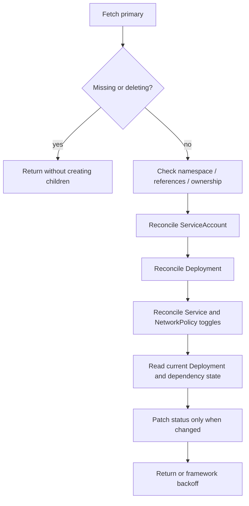

# Architecture and ownership contract

Status: accepted design, AWCP-2, 2026-09-12. AWCP-5 implements the shared engine,
ownership guard, watch/index wiring and bounded failure reporting; AWCP-6 implements
the Deployment mapping in [deployment lifecycle](deployment.md). Service/NetworkPolicy,
dedicated ServiceAccount creation, Secret prerequisites and complete observed status
remain later milestones. This document remains the target contract, not a claim of
full implementation.

## Control plane boundary

The user writes `AIWorkload.spec` to the Kubernetes API. The manager uses controller-runtime clients, caches and a rate-limited workqueue to compare that desired configuration with observed resources. The reconcile path does not execute `kubectl`, call an AI provider, or store state in a database.

The workload process owns its application logic. The manager owns only the derived Kubernetes configuration and its observations. External policy, admission, quotas, scheduler decisions and CNI behavior remain cluster responsibilities.

Default installation has manager namespace `awcp-system` and an explicit managed namespace `awcp-workloads`. Both are installer/operator-admin concerns, not AIWorkload children. A required manager setting `WATCH_NAMESPACE` selects exactly one workload namespace; an empty value fails startup rather than watching the cluster. A different configured namespace is allowed with matching RoleBindings. The manager cache, clients used for metadata reads, and request handling respect this scope. Leader-election Leases live in `awcp-system`.

## Resource responsibility matrix

| Resource | Source / controller ownership | Create | Update | Delete | Read/watch and failure boundary |
| --- | --- | --- | --- | --- | --- |
| AIWorkload spec/metadata | User-owned primary | User | User | User | Manager reads/watches; does not default by writing spec |
| AIWorkload status | Observed by manager | Status patch | Semantic changes only | Disappears with parent | Status subresource RBAC only; update conflicts retried |
| Deployment | Direct child of current CR UID | Manager | Managed fields | Kubernetes GC on parent delete | Recreate if missing; foreign owner is a conflict |
| Service | Optional direct child | Manager when enabled | Managed fields; retain allocated network fields | Manager on disable; GC on parent delete | Never replace a foreign Service |
| ServiceAccount | Direct child | Manager | Token automount and managed metadata | GC on parent delete | Never adopt `default` or attach workload RoleBindings |
| NetworkPolicy | Optional direct child | Manager when enabled | Whole controller-owned policy spec | Manager on disable; GC on parent delete | Other policies are neither edited nor removed |
| ReplicaSet / Pod | Transitive Deployment subtree | Native controllers | Native controllers | Native controllers / GC | Manager uses Deployment observations; no direct pod mutation |
| Referenced Secret | User-owned; no owner reference | User | User | User | Metadata existence/watch only in chosen implementation; RBAC can still authorize payload reads |
| Namespace | User/installer-owned; no owner reference | Admin/installer | Admin | Admin | Manager does not mutate or claim ownership |
| Shared CRD / CNI / telemetry infrastructure | Installer/platform-owned | Admin/installer | Admin/installer | Admin | Not children of an AIWorkload; API discovery/configuration is not ownership |

Manager installation also needs narrowly scoped Lease and Event writes. CRD installation and workload-namespace RoleBindings require administrator privileges that the running manager does not possess. These permissions are reviewed independently of workload identities in [ADR-005](adr/ADR-005-security-and-secret-boundaries.md).

## Naming and metadata

For each CR, all four child kinds share a deterministic name, because Kubernetes names are scoped by kind and namespace:

```text
awcp-<prefix>-<hash>
prefix = first 40 bytes of the ASCII CR name, '.' replaced by '-', trailing '-' trimmed
hash   = first 16 lowercase hex characters of SHA-256 of the full original CR name
```

This yields at most 62 characters and always starts with `awcp-`, satisfying the stricter Service DNS-label naming boundary. Even short names retain the hash, so the rule does not have a length-dependent transition. The same name in different namespaces is valid. A hash collision or reused name never authorizes takeover: ownership UID is checked separately.

Stable selector labels are `app.kubernetes.io/instance=<child-name>` and `platform.example.io/workload-uid=<parent-UID>`. Deployment selector and pod-template selector labels must match exactly; Service and NetworkPolicy use both labels. The UID prevents a newly created CR of the same name from selecting old pods.

Common metadata adds `app.kubernetes.io/name=ai-workload`, `app.kubernetes.io/part-of=ai-workload-control-plane` and `app.kubernetes.io/managed-by=awcp-controller`. The full original CR name may be stored in `platform.example.io/workload-name` annotation rather than a length-limited label. No Secret content, user token or arbitrary error body appears in generated metadata. Operator version must not be part of immutable selectors.

## Ownership guard

Every direct child has a controller ownerReference with the parent's apiVersion, kind, name and UID, within the same namespace. V0 does not require foreground deletion or `blockOwnerDeletion=true`; set the controller reference's blockOwnerDeletion to false and rely on background GC. This avoids adding unnecessary primary-delete/finalizer permission solely for owner-reference admission. Revisit if foreground deletion becomes a real requirement.

Before updating or deleting, verify that the existing controlling owner matches the current parent UID and kind. An unowned object, another controller's object or an old parent's object is `ResourceOwnershipConflict`. Preserve it, emit a bounded failure signal and wait for administrative correction; do not adopt it, strip its owner, or recreate it destructively. Deletes for optional children use UID preconditions to avoid deleting a replacement object between read and delete.

## Field management

| Child | Managed fields | Preserved / exceptional fields |
| --- | --- | --- |
| Deployment | replicas, fixed selector identity, named app container image/port/resources/probes/envFrom/security settings, pod ServiceAccount and token automount, rolling-update defaults | Preserve unrelated metadata and admission-injected sidecars/volumes; normalize API defaults; immutable selector mismatch is a visible conflict |
| Service | ClusterIP type, selectors, one TCP `http` port, targetPort `http` | Retain clusterIP, clusterIPs, ipFamilies and ipFamilyPolicy; incompatible immutable network allocation is reported |
| ServiceAccount | managed metadata, automountServiceAccountToken=false | Preserve non-managed metadata and server-maintained fields; do not grant RBAC |
| NetworkPolicy | managed metadata and desired spec | Preserve unrelated metadata; policy rules are controlled as a whole |

Use read/compare/merge-patch with optimistic concurrency. Compare semantic desired managed fields, not whole objects serialized with server defaults. Do not replace the entire Deployment spec or entire pod container list. If an admission controller keeps overriding an explicitly managed field, expose the failure/conflict; do not force ownership or create a hot loop. No server-side-apply adoption policy is introduced in V0.

## Reconcile sequence



Missing Secret is an observed unmet dependency, not permission to read or manufacture its value. It does not prevent creating a desired Deployment with non-optional envFrom references; the kubelet prevents new pods from starting without the Secret. Existing processes are not forcibly stopped. Status remains degraded until references and the current rollout are healthy. API permission errors must not be classified as missing objects.

The four resource writes are not a transaction. After partial failure, the next reconcile completes the remaining work. A lost cache, process restart or duplicate event must converge to the same desired objects. API `NotFound`, `AlreadyExists`, `Conflict`, `Forbidden`, timeout and throttling receive distinct handling. Return transient API errors to controller-runtime backoff. Persistent ownership/configuration failures wait for relevant change plus a bounded, low-frequency recovery recheck (default 60 seconds) without success/event spam.

## Watches and generation

- Primary watch: spec generation, deletion and lifecycle changes; do not rely exclusively on generation predicates for deletion.
- Owned watches: create/update/delete for all four child kinds; Deployment status changes must reach the reconciler even if generation is unchanged.
- Non-owned Secret watch: metadata-only watch with namespace/name to referencing CR field index. Index references even when the Secret does not exist. Create/delete/restore therefore requeues affected parents without a spec edit.
- Status-only writes by this controller must not create an endless primary watch/update cycle. No global GenerationChangedPredicate is applied to all watches.

Secret watch failure degrades manager readiness if the required cache cannot synchronize. A successfully synchronized cache later observing a missing Secret degrades that workload, not the entire manager. Manager liveness only tests the process; readiness covers startup/cache/leader readiness, not Grafana or external AI availability.

## Lifecycle and evidence

The status truth table and generation gates are in [API contract](api-contract.md). A parent deletionTimestamp short-circuits resource creation; a post-read deletion race may briefly create an owner-referenced child, which GC then removes. No finalizer is needed for these Kubernetes-only children. Uninstalling the operator must preserve CRs, their namespace and CRDs by default; explicit CRD removal is separately documented as destructive.

Unit tests prove mapping/decision logic. Envtest proves the real API's schema/defaulting/watch/status behavior and ownerReference values. It does not run the scheduler, kubelet or garbage collector. Real Deployment rollout, Service traffic, GC and optional CNI enforcement require kind E2E. See [ADR-004](adr/ADR-004-reconciliation-and-ownership.md) and [ADR-008](adr/ADR-008-deletion-and-finalizers.md).

## References

- [Kubernetes custom resources](https://kubernetes.io/docs/concepts/extend-kubernetes/api-extension/custom-resources/)
- [Owned resource watches](https://book.kubebuilder.io/reference/watching-resources/secondary-owned-resources.html)
- [Non-owned resource watches](https://book.kubebuilder.io/reference/watching-resources/secondary-resources-not-owned.html)
- [Envtest limitations](https://book.kubebuilder.io/reference/envtest.html)
